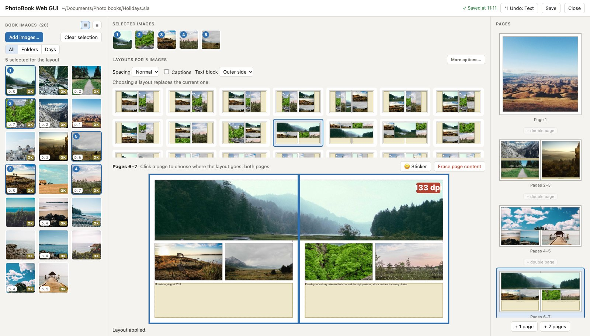
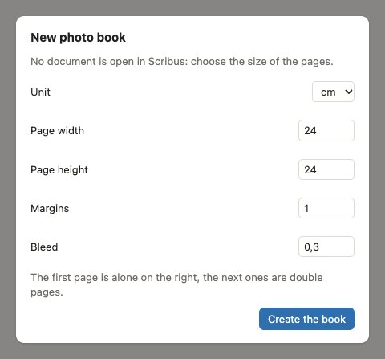
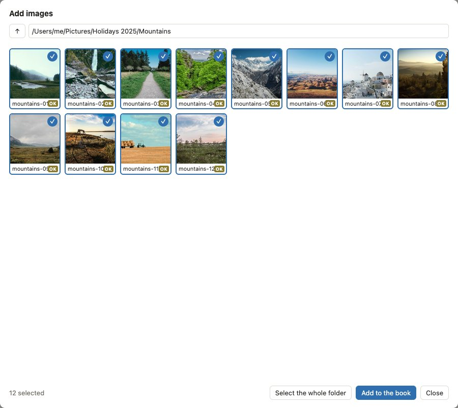
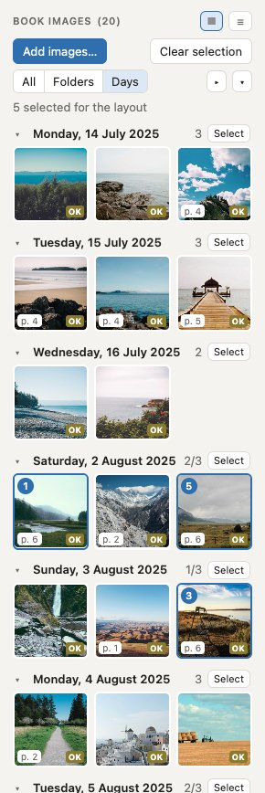
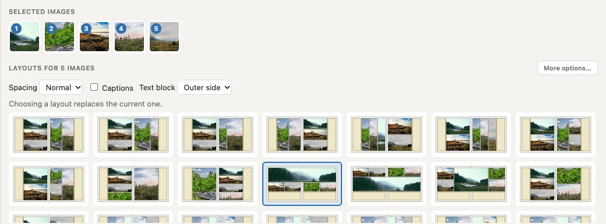
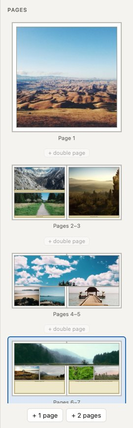
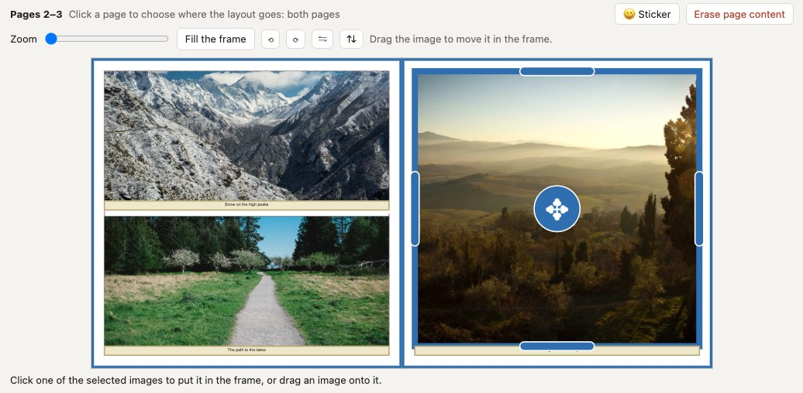

# PhotoBookTools for Scribus

**Make a photo book in Scribus from your browser.** PhotoBook Web GUI opens a page in your web browser, next to Scribus: pick the photos of the book, click a layout, and the pages are built in the Scribus document, with frames, photos filled and centered, captions and text blocks. Then crop, zoom, rotate, move photos between frames, adjust the frames, write the texts and add stickers, all in the same page. The book stays a normal Scribus document, ready for the export to PDF and the printer.

- **Left:** the images of the book, all together, by folder or by day.
- **Middle:** the selected photos, the layouts proposed for them, and the page or double page you are making.
- **Right:** the pages of the book, to choose a page, add pages or change their order.

## Contents

- [Installation](#installation)
- [Starting](#starting)
- [Making a book, step by step](#making-a-book-step-by-step)
- [The panels](#the-panels)
- [Working in the page](#working-in-the-page)
- [Texts and styles](#texts-and-styles)
- [Saving, undo and closing](#saving-undo-and-closing)
- [Stickers](#stickers)
- [Settings](#settings)
- [The other scripts](#the-other-scripts)
- [Credits and license](#credits-and-license)

## Installation

1. Install [Scribus](https://www.scribus.net) 1.5.8 or higher (1.6 recommended), with its Python scripter (included in the official versions).
2. Download this repository (green ‘Code’ button, then ‘Download ZIP’) and unzip it where you want to keep it.
3. Keep these files together in the `PhotoBookTools` folder:
   - `PhotoBookWebGUI.py`: the script to run in Scribus;
   - `PhotoBookWebGUI.html`: the web page;
   - `PhotoBookWebGUI.cfg`: the default settings;
   - `PhotoBookLanguage.py`: the translations (English and French, the language of the system is used).

Optional:
- **HEIC photos** (iPhone) are converted to JPEG with the tools of macOS; on Windows and Linux, install [Pillow](https://pypi.org/project/pillow/) for the Python of Scribus.
- **On macOS**, create the application ‘Livre photo’ to start everything with one click (see below).

Nothing is sent on the internet: the page talks only to Scribus, on your computer. The only exception is the drawing of the stickers, downloaded from Twemoji when you add one.

## Starting

**From Scribus:** open your book (or no document for a new book), then choose *Script > Execute Script…* and select `PhotoBookWebGUI.py`. The next times, it is in *Script > Recent Scripts*. The page opens in your default browser.

**On macOS, with the ‘Livre photo’ application:** double-click `Créer l'icône Livre photo.command` in the `PhotoBookTools` folder, once. It creates the application ‘Livre photo’ in the Applications folder of your home and shows it in the Finder: drag it to the Dock. Then:
- click it to start Scribus with the script;
- drop a Scribus book (`.sla`) on it to open this book with the script.

If Scribus is already open, run the script from the *Script* menu instead. When several versions of Scribus are installed, the command asks which one to use.

While the page is open, Scribus waits for it and does not respond: press **Close** in the page to come back to Scribus.

## Making a book, step by step

1. **Create the book.** With no document open in Scribus, the page asks for the size of the pages, the margins and the bleed. The first page is alone on the right, like a cover; the next ones are double pages.

   

2. **Add the images.** Click *Add images…*, go to the folder of your photos, tick them (or *Select the whole folder*), then *Add to the book*. They are not copied: the book points to them where they are.

   

3. **Add pages.** In the right panel, *+ 2 pages* adds a double page at the end, and the *+ double page* buttons between the double pages insert one there.
4. **Choose the page.** Click a double page in the right panel: the layouts are then made for both pages. In the middle panel, click one of the two pages to leave it out and lay out the other one only; click it again to take it back.
5. **Select photos.** Click the photos in the left panel, in the order you want them. They appear at the top of the middle panel.
6. **Click a layout.** The layouts for that number of photos are proposed, for a single page or across the double page (with or without one photo across the fold). A click builds the page in Scribus; clicking another layout replaces it, keeping the photos.
7. **Adjust.** Crop and zoom the photos, drag them from frame to frame, move the borders of the frames, write the captions and the text blocks.
8. **Close.** The book is saved; the pages are in Scribus, ready for the export to PDF.

## The panels

### Book images (left)

- **Views:** *All* the images, by *Folders*, or by *Days* (the day each photo was taken, read from its EXIF information). Folders and days can be folded (▸) and unfolded (▾); *Select* next to a folder or a day selects all its photos.
- **Thumbnails or list** (▦ and ☰ at the top).
- **Quality label** of each image, for the size of your pages: **HD** is good for a whole page, **OK** up to half a page, **Low** for small frames only.
- **Used photos** show the pages where they are (p. 4, 5), so you can see what is still to be placed.
- **⤢** shows an image large (with ◀ ▶ to go through them), **×** removes it from the book.
- Thumbnails are grey while they are prepared, then appear: you can start working at once, even with hundreds of photos.
- **Drag** an image from this panel onto a frame of the page to put it there.

### Selected images and layouts (middle, top)

- **Selected images**, in the order of the layout. *Clear selection* starts again.
- **Layouts:** the proposed layouts for these photos, for the page or the double page chosen on the right. The current layout of the page is marked. They are drawn with your photos, so you see the result before clicking.
- **Options** of the layout: **Spacing** between the frames (tight, normal, airy), **Captions** under each photo, a **Text block** (at the top, at the bottom or on the outer side). Changing an option updates the layout of the page.
- **More options…**: height of the captions, size of the text block, scaling, a fixed ratio for the frames, alignment, a dark grey or white border, and your own patterns: choose columns and rows, drag over cells to merge them, then *Save to my patterns* to find them among the layouts.
- **Editing a page made earlier:** click it, and its photos are shown as the selected images, as when it was made, with its options. Other layouts are proposed for them; add or remove photos in the left panel to change their number. The photos keep their crop, rotation and mirror, and each caption follows its photo.

### The page (middle)

The page or double page chosen, drawn with its photos, as in Scribus. This is where you work on the photos and texts: see [Working in the page](#working-in-the-page). Above it: **😀 Sticker** and **Erase page content**.

### Pages (right)

- The pages of the book, drawn with their content, two by two as in the printed book.
- **Click** a page or double page to show it in the middle panel and make its layouts.
- **+ 1 page**, **+ 2 pages** at the end; **+ double page** between two double pages to insert one there.
- **Drag** a double page to change its place in the book.

## Working in the page

**Photos**
- **Crop and zoom:** click a photo, then drag it to move it in its frame, and use the *Zoom* slider. *Fill the frame* comes back to a centered, full frame.
- **Rotate** by quarter turns (⟲ ⟳) and **mirror** left-right or up-down (⇋ ⇅). JPEG photos are rotated without being compressed again: a copy with another orientation is made in a `PhotoBook rotated` folder next to the photo.
- **Swap** two photos by dragging one onto the other; **replace** a photo by dragging an image from the left panel onto it, or by clicking one of the selected images at the top while the frame is selected.
- A photo with too few pixels for its frame (under 150 dpi) shows its resolution in red.

**Frames**
- **Resize:** drag the handles in the middle of the borders of a selected frame.
- **Move:** drag the handle in its center (✥), across or up and down.
- Frames stay inside the margins and never cover each other: a border sticks to the margins, to the borders of the other frames and at the spacing of the layout from them.
- The photo keeps its zoom and its center, and its caption stays under it.
- The page is then marked as adjusted by hand: changing the options does not lay it out again, choosing a layout does.

**Pages**
- **Erase page content** empties the chosen page or double page.
- Texts removed with their layout (captions or text block taken away) are kept aside with the page: the page shows them (*Show*), and they come back when captions or a text block are added again.

## Texts and styles

- **Click a caption or a text block** to write its text in the page, then *Done*.
- Every caption gets the paragraph style **PhotoBookCaption**, every text block the style **PhotoBookText**. They are created the first time, and each text edited from the page gets its style if it has none. Change these styles in Scribus (*Edit > Styles*) to change all the captions or all the texts of the book at once. A text to which you gave another style in Scribus keeps it.
- A text formatted in Scribus (several fonts, sizes or colors) is outlined in orange: the page warns you that editing it there would lose this formatting.
- Color emojis cannot be printed in Scribus texts: use [stickers](#stickers).

## Saving, undo and closing

- **Save:** the first time, choose where to save the book. Then every change is saved automatically.
- **Undo** (↶, Ctrl+Z or Cmd+Z) undoes the last actions, even after an automatic save, until the page is closed.
- **Close:** comes back to Scribus, saving the book. Scribus may take a few seconds to redraw the pages. You can reopen the page at any time to go on.
- The list of the images of the book is kept next to it (`book.photobook.json`).

## Stickers

Scribus cannot print color emojis in texts (emojis typed in a caption disappear from the printed book). Use instead the **😀 Sticker** button above the page: click an emoji of the list, or type or paste any other emoji in the *Other emoji* field (emoji picker: Ctrl+Cmd+Space on Mac, Windows+. on Windows). It is placed on the page as a color image (PNG with a transparent background, 1024 pixels), that you can drag anywhere on the page or double page, resize or delete.

The images are saved in a `PhotoBook stickers` folder next to the book (or next to its images while the book is not saved yet): keep this folder with the book. When the computer is connected to the internet, the stickers are drawn from [Twemoji](https://github.com/jdecked/twemoji), graphics licensed under CC-BY 4.0: credit them in your book, for example ‘Emojis: Twemoji, © Twitter and other contributors, CC-BY 4.0’. Without internet, the emojis of your system are used (Apple, Microsoft or Google emojis, which are less sharp when printed large, and whose use is ruled by their owners).

## Settings

- **Save settings as default** (in *More options…*) keeps the current options for the next books, in `PhotoBookWebGUI.cfg`.
- **Language:** the page and the messages follow the language of the system (English or French). To force one, set `LANGUAGE = 'en'` or `'fr'` at the top of `PhotoBookLanguage.py`.

## The other scripts

The first tools of this collection are still there, for those who prefer to work in Scribus directly (see `Instructions.pdf` in the `PhotoBookTools` folder):

1. `PhotoBookLayoutMaker.py` generates layouts of image frames (they can be saved in the Scrapbook for later use). PhotoBook Web GUI proposes the same layouts.
2. Insert the images in bulk into the image frames.
3. `PhotoBookFillFramesCentered.py` fills the selected image frames with their images, centered. Adjust by hand if needed.
4. `PhotoBookImageCropResize.py` crops the images to their frames and resizes them to the wanted resolution, to make the files smaller.
5. Write the captions (if created in step 1), then export the book to PDF or other formats.

A little demo video of these scripts: https://www.youtube.com/watch?v=3bcF4KhCCJg

## Credits and license

- PhotoBook Tools: GNU General Public License version 3 (see [LICENSE](LICENSE)).
- The photos of the screenshots come from [Unsplash](https://unsplash.com) (Unsplash license, free to use), by Paul Jarvis, Austin Neill, Nicholas Swanson, May Pamintuan, Jerry Adney, Go Wild, Jeffrey Kam, Margaret Barley, Daniel Genser, Jon Eckert, Gozha Net and Caroline Sada.
- Stickers: [Twemoji](https://github.com/jdecked/twemoji), CC-BY 4.0.
